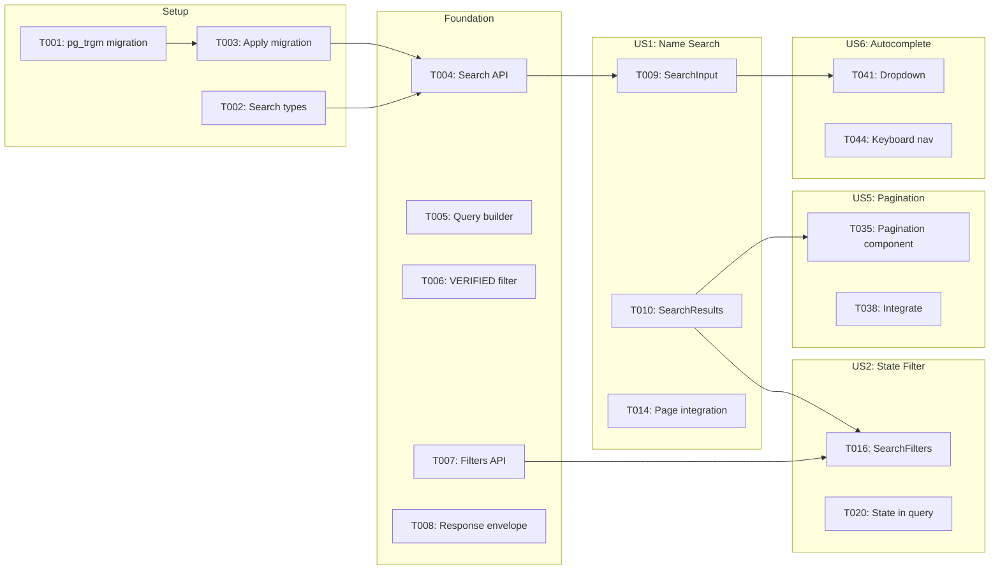

# Tasks: Search & Discovery

**Feature**: 009-search-discovery  
**Input**: Design documents from `/specs/009-search-discovery/`
**Prerequisites**: plan.md ✅, spec.md ✅, research.md ✅, data-model.md ✅, contracts/ ✅

## Format: `[ID] [P?] [Story?] Description`

- **[P]**: Can run in parallel (different files, no dependencies)
- **[Story]**: Which user story this task belongs to (e.g., US1, US2, US3)
- Include exact file paths in descriptions

---

## Phase 1: Setup (Database & Types)

**Purpose**: Database migration for search index and shared TypeScript types

- [x] T001 Create pg_trgm migration in `prisma/migrations/[timestamp]_add_search_index/migration.sql`
- [x] T002 [P] Create search types in `src/lib/search.ts` (SearchParams, SearchResult, SearchResponse, FilterOptions interfaces)
- [x] T003 Run `npx prisma migrate dev` to apply search index

---

## Phase 2: Foundational (Search API)

**Purpose**: Core search API that ALL user stories depend on

**⚠️ CRITICAL**: No UI work can begin until this phase is complete

- [x] T004 Create search API route in `src/app/api/search/route.ts` with GET handler
- [x] T004a Validate/sanitize search API parameters (limit max 100, page >= 1, sanitize q)
- [x] T005 Implement Prisma query builder in `src/lib/search.ts` (buildSearchQuery function)
- [x] T005a Add input normalization (unicode, apostrophes, hyphens) before query per edge case
- [x] T005b Add `ORDER BY similarity(fullName, query) DESC` for relevance ranking per SC-003
- [x] T006 Add VERIFIED-only filter to search query (Constitution Principle I)
- [x] T007 Create filters API route in `src/app/api/search/filters/route.ts` (states, courtTypes)
- [x] T008 Add response envelope with pagination metadata (total, page, limit, totalPages)

**Checkpoint**: API ready — curl `/api/search?q=Smith` returns JSON results

---

## Phase 3: User Story 1 - Quick Judge Name Search (Priority: P1) 🎯 MVP

**Goal**: Users can search for judges by name and click through to profile pages

**Independent Test**: Type "Martinez" and verify matching judges appear; click a name to view profile

### Implementation for User Story 1

- [x] T009 [US1] Create SearchInput component in `src/components/search/SearchInput.tsx`
- [x] T010 [US1] Create SearchResults component in `src/components/search/SearchResults.tsx`
- [x] T011 [US1] Add result card with judge name, court, state context per FR-015
- [x] T012 [US1] Implement text highlighting for search matches per FR-011
- [x] T013 [US1] Add click handler to navigate to judge profile page
- [x] T014 [US1] Integrate SearchInput and SearchResults into `src/app/judges/page.tsx`
- [x] T015 [US1] Add "No judges found" empty state per FR-017

**Checkpoint**: User Story 1 complete — name search works end-to-end

---

## Phase 4: User Story 2 - Filter by State (Priority: P2)

**Goal**: Users can filter judges by state, combining with name search

**Independent Test**: Select "California" and verify only CA judges appear

### Implementation for User Story 2

- [x] T016 [US2] Create SearchFilters component in `src/components/search/SearchFilters.tsx`
- [x] T017 [US2] Add state dropdown populated from `/api/search/filters` endpoint
- [x] T018 [US2] Create FilterChip component in `src/components/search/FilterChip.tsx`
- [x] T019 [US2] Display active state filter as badge/chip per acceptance scenario 4
- [x] T020 [US2] Add state filter to search API query in `src/lib/search.ts`
- [x] T021 [US2] Implement "Clear filters" button per FR-016
- [x] T022 [US2] Persist state filter in URL query params per FR-009

**Checkpoint**: User Story 2 complete — state filter works with search

---

## Phase 5: User Story 3 - Filter by Court Type (Priority: P3)

**Goal**: Users can filter judges by court type (Supreme Court, Circuit Court, etc.)

**Independent Test**: Select "Supreme Court" and verify only supreme court judges appear

### Implementation for User Story 3

- [x] T023 [US3] Add court type dropdown to SearchFilters component
- [x] T024 [US3] Populate court types from `/api/search/filters` (dynamic from DB)
- [x] T025 [US3] Add courtType filter to search API query
- [x] T026 [US3] Display active court type filter as badge/chip
- [x] T027 [US3] Persist courtType filter in URL query params

**Checkpoint**: User Story 3 complete — court type filter works with state filter and search

---

## Phase 6: User Story 4 - Filter by County (Priority: P4)

**Goal**: Users can filter judges by county after selecting a state

**Independent Test**: Select "Florida" then "Miami-Dade" and verify only Miami-Dade judges appear

### Implementation for User Story 4

- [x] T028 [US4] Add county dropdown to SearchFilters (initially disabled)
- [x] T029 [US4] Add `?state=XX` parameter to `/api/search/filters` for county list
- [x] T030 [US4] Enable county dropdown when state is selected
- [x] T031 [US4] Reset county filter when state changes per acceptance scenario 3
- [x] T032 [US4] Add county filter to search API query
- [x] T033 [US4] Display "Select a state first" helper text when disabled
- [x] T034 [US4] Persist county filter in URL query params

**Checkpoint**: User Story 4 complete — cascading county filter works

---

## Phase 7: User Story 5 - Search Results Pagination (Priority: P5)

**Goal**: Users can navigate through pages of results; pagination state persists in URL

**Independent Test**: Search with no filters, navigate to page 3, refresh, stay on page 3

### Implementation for User Story 5

- [x] T035 [US5] Create Pagination component in `src/components/ui/pagination.tsx`
- [x] T036 [US5] Display "Showing X of Y judges" result count per FR-010
- [x] T037 [US5] Add page navigation (Previous, page numbers, Next)
- [x] T038 [US5] Integrate pagination into SearchResults component
- [x] T039 [US5] Persist page number in URL query params
- [x] T040 [US5] Reset to page 1 when search query or filters change

**Checkpoint**: User Story 5 complete — pagination works with URL persistence

---

## Phase 8: User Story 6 - Autocomplete Suggestions (Priority: P6)

**Goal**: Users see instant suggestions as they type, with keyboard navigation

**Independent Test**: Type "Smi", see suggestions dropdown, use arrow keys to navigate, press Enter to select

### Implementation for User Story 6

- [x] T041 [US6] Add autocomplete dropdown to SearchInput component
- [x] T042 [US6] Implement debounced API calls (150ms) per FR-014
- [x] T043 [US6] Trigger autocomplete after 2+ characters per FR-013
- [x] T044 [US6] Add keyboard navigation (Arrow Up/Down, Enter, Escape)
- [x] T045 [US6] Implement WAI-ARIA combobox pattern (role="combobox", role="listbox")
- [x] T046 [US6] Cancel pending requests when input changes or clears
- [x] T047 [US6] Style autocomplete dropdown with match highlighting

**Checkpoint**: User Story 6 complete — autocomplete with keyboard nav works

---

## Phase 9: Polish & Cross-Cutting Concerns

**Purpose**: Accessibility, mobile responsiveness, edge cases, SEO

- [x] T048 Add keyboard navigation for all filters (Tab, Enter) per FR-018
- [x] T048a Add skip-navigation link on `/judges` page per Constitution Principle VI
- [x] T049 [P] Add visible focus indicators per WCAG 2.1 AA
- [x] T050 [P] Add mobile-responsive styles for search and filters
- [x] T051 [P] Ensure search page SSR for SEO per Constitution Principle II
- [x] T052 Test and fix Lighthouse accessibility score ≥90
- [x] T053 Test empty states: no results, no verified judges in state
- [x] T054 Update `/judges` page metadata for SEO (title, description)

---

## Dependencies

## Parallel Execution Opportunities

**Setup**: T001 and T002 can run in parallel

**US2-US4** (filters) can be parallelized across different components:

- T017 (state dropdown) || T023 (court type dropdown) || T028 (county dropdown)

**Phase 9** (Polish): T049, T050, T051 can run in parallel

## Implementation Strategy

1. **MVP First (P1)**: Complete Phase 1-3 for basic search functionality
2. **Filter Expansion (P2-P4)**: Add filters incrementally in Phase 4-6
3. **Pagination (P5)**: Add after filters work
4. **Enhancement (P6)**: Autocomplete is enhancement layer
5. **Polish**: Accessibility and mobile last but critical

**Estimated Total**: 58 tasks across 9 phases
